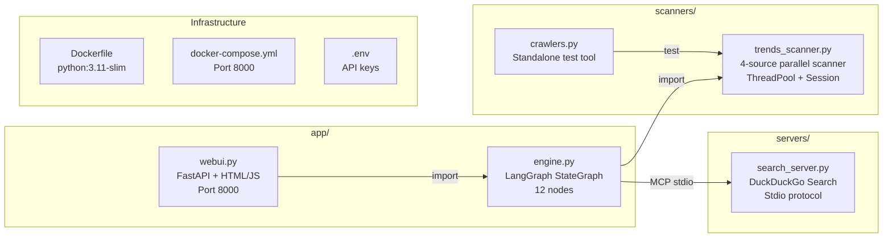
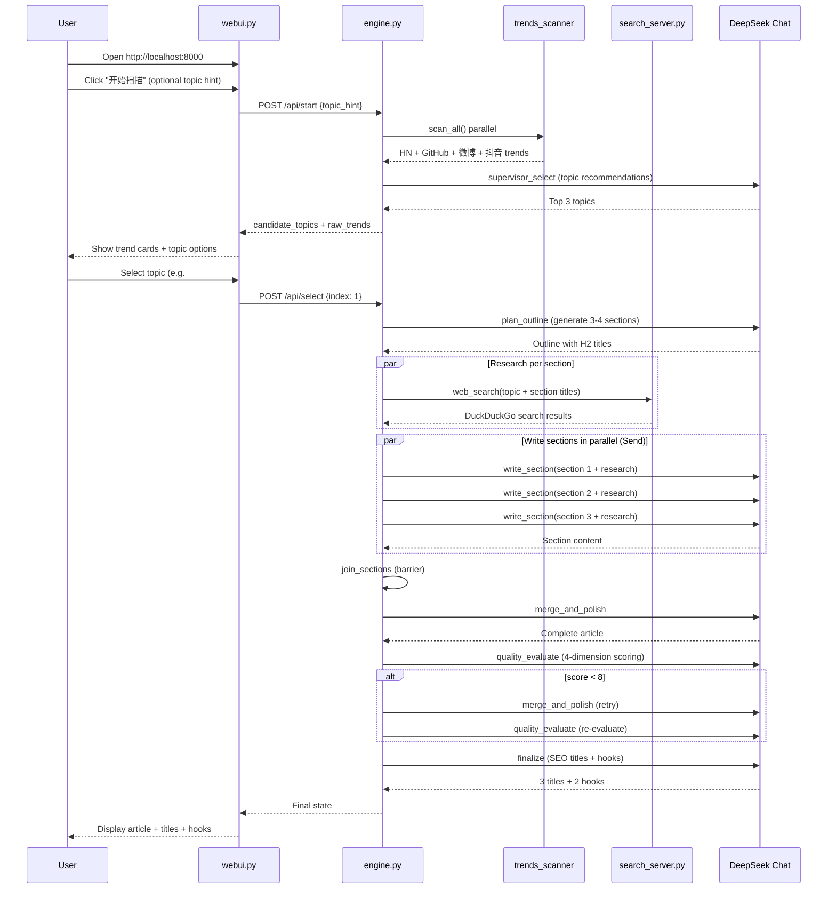
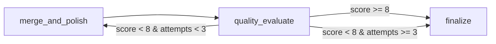

# Architecture Design Document

## Overview

A LangGraph-based multi-agent blog writing system designed for content marketing teams. The system automates the entire blog creation pipeline: trend discovery → topic selection → research → parallel writing → quality evaluation → SEO optimization.

**Key Metrics**:
- End-to-end latency: ~75s (12-node DAG)
- Token cost: ~9.5K in / 4.3K out per article
- Sources: 4 trend feeds + DuckDuckGo Search
- Output: 3000-5000 word Markdown article

---

## System Architecture

```mermaid
graph TB
    subgraph User["User Layer"]
        UI[Web UI<br/>FastAPI + Vanilla JS]
        CLI[CLI<br/>python run.py]
    end

    subgraph LangGraph["Orchestration Layer - LangGraph StateGraph"]
        S1[scan_sources<br/>ThreadPool × 4 sources]
        S2[supervisor_select<br/>LLM topic recommendation]
        S3[confirm_topic<br/>Human-in-the-Loop]
        S4[plan_outline<br/>LLM outline generation]
        S5[validate_outline<br/>Regex/H2 count check]
        S6[research_topic<br/>MCP DuckDuckGo Search]
        S7[write_section × N<br/>Send() parallel writing]
        S8[join_sections<br/>Barrier node]
        S9[merge_and_polish<br/>Reduce]
        S10[quality_evaluate<br/>LLM 4-dimension scoring]
        S11[finalize<br/>SEO titles + tweet hooks]

        S1 --> S2 --> S3 --> S4 --> S5 --> S6 --> S7
        S7 --> S8 --> S9 --> S10 --> S11
        S5 -.-|retry ×3| S4
        S10 -.-|score<8| S9
    end

    subgraph Data["Data Sources"]
        HN[HackerNews API]
        GH[GitHub Trending<br/>Web Scrape]
        WB[微博热搜<br/>Mobile API]
        DY[抖音热搜<br/>API]
    end

    subgraph MCP["MCP Servers"]
        BS[search_server.py<br/>DuckDuckGo Search]
    end

    subgraph LLM["LLM Backend"]
        DS[DeepSeek Chat<br/>deepseek-chat]
    end

    S1 --> HN
    S1 --> GH
    S1 --> WB
    S1 --> DY
    S6 --> BS
    S2 --> DS
    S4 --> DS
    S7 --> DS
    S9 --> DS
    S10 --> DS
    S11 --> DS
    UI -->|HTTP| S1
    CLI -->|direct invoke| S1
```

---

## Component Architecture



---

## Data Flow



---

## Key Design Decisions

### 1. LangGraph StateGraph over Linear Chain
- Provides built-in `Send()` for Map-Reduce parallelism
- `interrupt_before` enables natural Human-in-the-Loop without complex state machines
- `MemorySaver` checkpointer allows runtime interruption/resume
- Conditional edges enable retry loops for quality control

### 2. MCP (Model Context Protocol) for Tool Integration
- Standardized protocol between agent and external tools (DuckDuckGo Search)
- Each MCP server runs as a separate subprocess, providing isolation
- stdio transport is lightweight — no HTTP server needed for tool communication
- Easy to add new tools: create a new MCP server + register as LangChain tool

### 3. Map-Reduce Architecture
- **Map**: `Send()` fans out to N parallel `write_section` nodes
- **Barrier**: `join_sections` explicitly waits for all branches
- **Reduce**: `merge_and_polish` combines partial results into final article
- Reduces end-to-end latency from O(N) to O(1) for N sections

### 4. Dual-Mode Topic Selection
- **Trend-driven** (no hint): Supervisor selects from scanned trends
- **Hind-driven** (user provides topic): Supervisor uses LLM knowledge only
- Trends are always displayed in UI regardless of mode

### 5. Quality Evaluation Loop


---

## Performance Characteristics

| Phase | Node | LLM | Avg Time | Token (in/out) |
|-------|------|-----|----------|-----------------|
| Scanning | `scan_sources` | ❌ | ~6s | — |
| Selection | `supervisor_select` | ✅ | ~10s | 1.2K / 500 |
| Planning | `plan_outline` | ✅ | ~8s | 300 / 300 |
| Research | `research_topic` | ❌(MCP) | ~4s | — |
| Writing ×4 | `write_section` | ✅ | ~15s | 1.2K / 1.8K |
| Merge | `merge_and_polish` | ✅ | ~20s | 2.5K / 1.5K |
| Eval | `quality_evaluate` | ✅ | ~5s | 1.5K / 50 |
| Finalize | `finalize` | ✅ | ~5s | 1.2K / 200 |
| **Total** | | | **~75s** | **9.5K / 4.3K** |

---

## Project Structure

```
d:\somshi\
├── app/
│   ├── __init__.py
│   ├── engine.py           # LangGraph StateGraph (12 nodes)
│   └── webui.py            # FastAPI frontend
├── scanners/
│   ├── __init__.py
│   ├── trends_scanner.py   # 4-source parallel trend scanner
│   └── crawlers.py         # Standalone crawler test tool
├── servers/
│   ├── __init__.py
│   └── search_server.py    # DuckDuckGo Search server
├── run.py                  # CLI entry point
├── Dockerfile              # Container build
├── docker-compose.yml      # Container orchestration
├── requirements.txt
└── .env.example
```

---

## Getting Started (Docker)

```powershell
# 1. Configure API keys
copy .env.example .env
# Edit .env with your DEEPSEEK_API_KEY only
# DuckDuckGo search is free, no API key needed

# 2. Build and run
docker compose up -d

# 3. Open browser
# http://localhost:8000

# 4. View logs
docker compose logs -f
```

---

## Future Considerations

| Area | Suggestion |
|------|-----------|
| Persistence | Replace MemorySaver with PostgresSaver or Redis checkpoint for production |
| Authentication | Add API key or OAuth for multi-user scenarios |
| Article scheduling | Add cron trigger for daily automated publishing |
| Image generation | Integrate DALL-E / Stable Diffusion via MCP for cover images |
| Multi-language | Extend supervisor prompt to support zh-CN / en-US / ja-JP output |
| Rate limiting | Add circuit breaker for LLM API calls to handle throttling |
